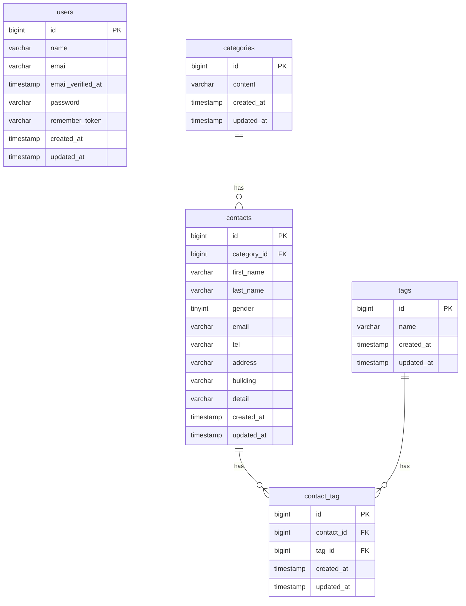

# COACHTECH お問い合わせフォーム

## 概要

お問い合わせフォームと管理画面を備えたお問い合わせ管理アプリです。

以下の機能を実装しました。

- お問い合わせ入力・確認・登録機能
- 管理画面でのお問い合わせ一覧表示
- お問い合わせ検索機能
- お問い合わせ詳細表示
- お問い合わせ削除機能
- タグ管理機能
- ユーザー認証機能

## ER図



## 環境構築手順

### 1. リポジトリをclone

GitHubからリポジトリをcloneします。

```bash
git clone https://github.com/Yutaka-1101/contact-form-app

cd contact-form-app
```

### 2. 環境ファイルの作成

`.env.example` をコピーして `.env` を作成します。

```bash
cp .env.example .env
```

### 3. Dockerコンテナの起動

Laravel Sailを起動します。

```bash
sail up -d
```

### 4. Composerパッケージのインストール

必要なPHPパッケージをインストールします。

```bash
sail composer install
```

### 5. アプリケーションキーを生成します。

```bash
sail artisan key:generate
```

### 6. 環境変数の設定

`.env` ファイルのデータベース接続環境を以下の内容に設定します。

```env
DB_CONNECTION=mysql
DB_HOST=mysql
DB_PORT=3306
DB_DATABASE=laravel
DB_USERNAME=sail
DB_PASSWORD=password
```

※`DB_HOST` は `localhost` や `127.0.0.1` ではなく、Dockerコンテナ名の 'mysql' を指定してください。

### 7. データべースの作成

マイグレーションとシーディングを実行します。

```bash
sail artisan migrate --seed
```

既存のデータベースをリセットする場合は、以下を実行してください。

```bash
sail artisan migrate:fresh --seed
```

### 8. フロントエンドのセットアップ

Node.jsの依存パッケージをインストールします。

```bash
sail npm install
```

Viteサーバーを起動します。

```bash
sail npm run dev
```

※ `sail npm run dev` は実行した状態で開発を行ってください。

### 9. アプリケーションの確認

以下のURLにアクセスしてください。

http://localhost

### 10. テスト実行

PHPUnitテストを実行する場合は、以下のコマンドを使用してください。

```bash
sail artisan test

```

## 使用技術

- PHP 8.x
- Laravel 10.x
- MySQL
- Docker
- Laravel Sail
- Laravel Fortify
- PHPUnit

## 開発環境URL

http://localhost

## 作成者

髙橋 豊
