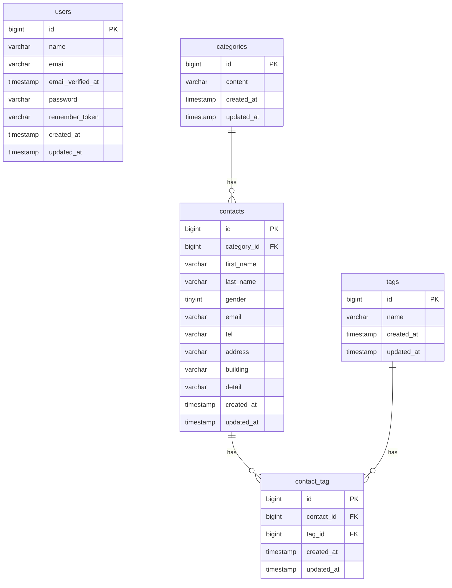

# COACHTECH お問い合わせフォーム

## 概要

お問い合わせフォームと管理画面を備えたお問い合わせ管理アプリです。

以下の機能を実装しました。

- お問い合わせ入力・確認・登録機能
- 管理画面でのお問い合わせ一覧表示
- お問い合わせ検索機能
- お問い合わせ詳細表示
- お問い合わせ削除機能
- タグ管理機能
- ユーザー認証機能

## ER図



## 環境構築手順

### 1. Laravelプロジェクトの作成 (Laravel 10.x)

# Laravel 10.x を指定してプロジェクトを作成

docker run --rm \
 -u "$(id -u):$(id -g)" \
 -v "$(pwd):/var/www/html" \
 -w /var/www/html \
 -e COMPOSER_CACHE_DIR=/tmp/composer_cache \
 laravelsail/php82-composer:latest \
 composer create-project laravel/laravel:^10.0 contact-form-app

### 2. Laravel Sailのインストール

プロジェクト作成後、contact-form-app ディレクトリに移動し、Laravel Sailをインストールします。

# プロジェクトディレクトリに移動

cd contact-form-app

# Laravel Sailをインストール

docker run --rm \
 -u "$(id -u):$(id -g)" \
 -v "$(pwd):/var/www/html" \
 -w /var/www/html \
 -e COMPOSER_CACHE_DIR=/tmp/composer_cache \
 laravelsail/php82-composer:latest \
 composer require laravel/sail --dev

# Sailの設定ファイルをパブリッシュ（MySQLを選択）

docker run --rm \
 -u "$(id -u):$(id -g)" \
 -v "$(pwd):/var/www/html" \
 -w /var/www/html \
 -e COMPOSER_CACHE_DIR=/tmp/composer_cache \
 laravelsail/php82-composer:latest \
 php artisan sail:install --with=mysql

### 3. .env ファイルの設定

".env ファイルを開き、データベース接続情報が以下と一致していることを確認します。

DB_CONNECTION=mysql
DB_HOST=mysql
DB_PORT=3306
DB_DATABASE=laravel
DB_USERNAME=sail
DB_PASSWORD=password

重要: DB_HOST は localhost や 127.0.0.1 ではなく、Dockerコンテナ名である mysql を指定します。"

### 4. フロントエンドのセットアップ (Vite & Tailwind CSS)

本プロジェクトでは、フロントエンドのスタイリングにTailwind CSSを使用します。

1. NPM依存パッケージのインストール

重要: sail npm install を実行する前に、必ずSailコンテナが起動していることを確認してください。

sail npm install

2. Tailwind CSSのインストール

    sail npm install -D tailwindcss@^3.4.0 postcss autoprefixer
    sail npm install alpinejs

3. 設定ファイルの生成

    sail npx tailwindcss init -p

4. Tailwind CSSのテンプレートパス設定
   tailwind.config.js を開き、以下のように設定します。
   /** @type {import("tailwindcss").Config} \*/
   export default {
   content: [
   "./resources/**/_.blade.php",
   "./resources/\*\*/_.js",
   "./resources/\*_/_.vue",
   ],
   theme: {
   extend: {},
   },
   plugins: [],
   }

5. Vite開発サーバーの起動

    sail npm run dev

注意: sail npm run dev は実行したままにしておく必要があります。

### 5. phpMyAdminの追加

compose.yaml を開き、mysql サービスの後に以下の設定を追加してください。

compose.yaml に追加する内容:

    phpmyadmin:
        image: 'phpmyadmin:latest'
        ports:
            - '${FORWARD_PHPMYADMIN_PORT:-8080}:80'
        environment:
            PMA_HOST: mysql
            PMA_USER: '${DB_USERNAME}'
            PMA_PASSWORD: '${DB_PASSWORD}'
        networks:
            - sail
        depends_on:
            - mysql

### 6. Sailの起動とエイリアス設定

# Sailをバックグラウンドで起動

./vendor/bin/sail up -d

# エイリアスを設定して 'sail' だけでコマンドを実行できるようにする

echo ""alias sail='[ -f sail ] && bash sail || bash vendor/bin/sail'"" >> ~/.zshrc

# または bash の場合

# echo ""alias sail='[ -f sail ] && bash sail || bash vendor/bin/sail'"" >> ~/.bashrc

# シェルを再起動するか、新しいターミナルを開いてエイリアスを有効にする

exec $SHELL

### 7. アプリケーションキーの生成

ルートで以下のコマンドを実行する
sail artisan key:generate"

### 8. データベースのマイグレーションと初期データ投入

"以下のコマンドでテーブルを作成し、初期データを投入します。
sail artisan migrate --seed

※既存のデータベースをリセットしたい場合は以下を実行してください。
sail artisan migrate:fresh --seed

## 使用技術

- PHP 8.x
- Laravel 10.x
- MySQL
- Docker
- Laravel Sail
- Laravel Fortify
- PHPUnit

## 開発環境URL

http://localhost

## 作成者

髙橋 豊

```

```
